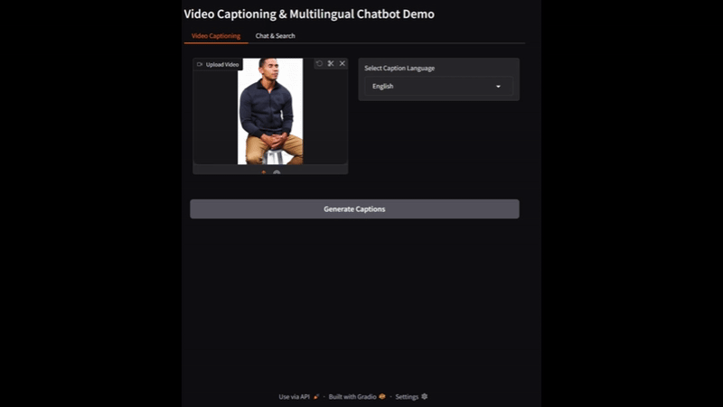

# Multimodal Video Captioning & Multilingual Chatbot
<p align="center">
  <a href="MULTILINGUAL_CHATBOT.mp4">
    
  </a>
</p>

A desktop application for video captioning and multilingual chat with real-time video analysis capabilities.

## Features

- **Video Captioning**: Generate real, word-for-word captions for video files using Whisper (speech-to-text) and translate them to your selected language using OpenAI GPT
- **Multilingual Chat**: Support for multiple languages (English, Spanish, French, German, Italian, Portuguese, Russian, Chinese, Japanese, Korean)
- **Real-time Communication**: WebSocket-based communication between GUI and backend
- **Video Timeline**: Interactive timeline with clickable captions
- **Search & Retrieval**: Search through video content using natural language queries
- **Gradio Demo**: Web-based interface for easy testing

## Prerequisites

### System Requirements
- **OS**: Linux, macOS, or Windows
- **C++ Compiler**: GCC 7+ or Clang 6+ (Linux/macOS), Visual Studio 2019+ (Windows)
- **Python**: 3.8+
- **CMake**: 3.16+

### Dependencies

#### C++ Dependencies
- **Qt5**: Core, Widgets, Multimedia, Network, WebSockets
- **FFmpeg**: Video processing
- **ONNX Runtime**: AI model inference
- **FAISS**: Vector similarity search
- **fastText**: Language detection
- **Boost**: Asio for networking
- **Google Test**: Unit testing

#### Python Dependencies
- **Gradio**: Web interface
- **Requests**: HTTP client
- **NumPy**: Numerical computing
- **OpenAI**: GPT-based translation and chatbot
- **openai-whisper**: Speech-to-text transcription
- **ffmpeg**: Audio extraction from video (system dependency)

## Installation

### 1. Clone the Repository
```bash
git clone <repository-url>
cd MultimodalVideoChatbot
```

### 2. Install System Dependencies

#### Ubuntu/Debian
```bash
sudo apt update
sudo apt install build-essential cmake qt5-default libavformat-dev libavcodec-dev libswscale-dev libavutil-dev libgtest-dev nlohmann-json3-dev
```

#### macOS
```bash
brew install cmake qt5 ffmpeg onnxruntime faiss-cpu fasttext googletest nlohmann-json
```

#### Windows
Install Visual Studio 2019 or later with C++ development tools, then install vcpkg and the required packages.

### 3. Install Python Dependencies
```bash
pip install -r gradio_demo/requirements.txt
pip install openai-whisper
```

### 4. Install FFmpeg (for audio extraction)
#### Ubuntu/Debian
```bash
sudo apt-get update && sudo apt-get install ffmpeg
```
#### macOS
```bash
brew install ffmpeg
```
#### Windows
Download from https://ffmpeg.org/download.html and add to PATH.

### 5. Build the Project
```bash
chmod +x scripts/build.sh
./scripts/build.sh
```

## Configuration

### 1. OpenAI API Key (Required for translation)
Create a `.env` file in the project root with:
```
OPENAI_API_KEY=your_openai_key_here
```

### 2. Hugging Face API Token (Optional)
For enhanced translation capabilities, set your Hugging Face API token:

```bash
export HUGGINGFACE_API_TOKEN="your_token_here"
```

You can get a free token from [Hugging Face](https://huggingface.co/settings/tokens).

### 3. Model Files (Optional)
For production use, you'll need to provide ONNX model files:
- `models/video_captioning.onnx`: Video captioning model
- `models/text_encoder.onnx`: Text embedding model
- `models/conversational_model.onnx`: Conversational AI model

Place these files in the `models/` directory.

## Usage

### GUI Application

1. **Start the WebSocket Server**:
```bash
./build/websocket_server
```

2. **Launch the GUI Application**:
```bash
./build/VideoChatbot
```

3. **Using the Application**:
   - **Video Captioning Tab**: Upload a video file and generate captions
   - **Chat & Search Tab**: Ask questions about the video content in any supported language

### Gradio Web Demo

1. **Start the WebSocket Server**:
```bash
./build/websocket_server
```

2. **Launch the Gradio Demo**:
```bash
cd gradio_demo
python app.py
```

3. **Access the Web Interface**: Open your browser to `http://localhost:7860`

4. **Video Captioning Tab**: Upload a video file, select your desired caption language, and generate real, word-for-word captions. If the language is not English, captions are translated using OpenAI GPT.

## Avatar Credits


The avatar used in this project was created using [HeyGen](https://app.heygen.com/home).


